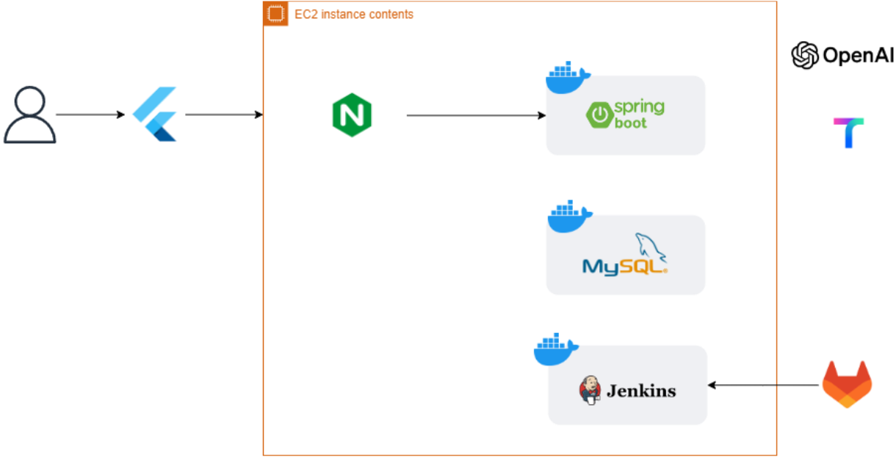
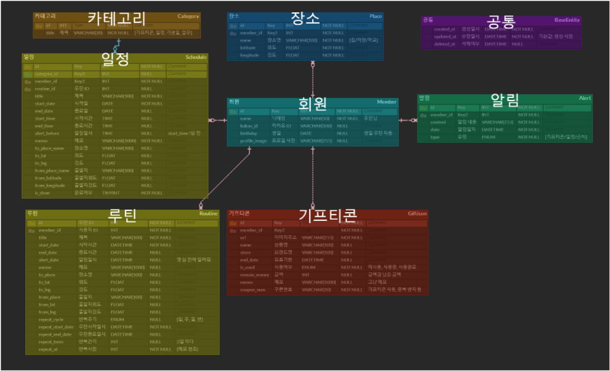

#### 목차

1. [프로젝트 소개](#-프로젝트-소개)   
2. [기능](#-기능)  
5. [팀 소개](#-팀-소개)  

 

# 🐹 프로젝트 소개

### 🐤 프로젝트 기간
2024.04.09 - 2024.05.20 (7주)

> **기획 및 설계** : 2024.04.09 - 2023.04.30 (3주)
>
> **기능 구현** : 2024.05.01 - 2024.05.20 (4주)

 

### 🐓 서비스 소개 

**서비스 명** : 쮝사

일상에서 잊어버리기 쉬운 일들을 까먹지 않게 챙겨주는 서비스

 

### 🐣 기능

### 일정관리
    ✔ 자연어 형식 일정을 자동으로 인식하여 생성
    ✔ 반복 일정 생성
    ✔ 대시보드에서 오늘의 일정, 일정 통계 확인
    ✔ 등록된 일정의 위치에 가까워지면 해당 일정 알림

### 기프티콘 관리
    ✔ 기프티콘 이미지를 인식하여 자동으로 등록
    ✔ 유효기간과 남은 금액 관리

 
 
 

### 🐥 기술 스택
|구분|기술|
|:---|:---|
|Infra||
|Frontend||
|Backend||
|Management Tool|
|IDE||

 

### 🦜 설계

**인프라 아키텍쳐**

 

**ERD**

**외부 문서**
- [와이어프레임](https://www.figma.com/design/9TAmxpJ0IR71gbQ0Q22BwS/A202)

 
 
 

### 🕊 실행방법

exec 폴더 내 포팅 메뉴얼 참조

 
 
 

# 👨‍👩‍👧‍👦 팀 소개 

**삼성 청년 SW 아카데미** 10기 서울 2반 2조 369팀

|조아영|유소연|최은비|박이언|최지원|
|:---|:---|:---|:---|:---|
|FE|BE/Infra|FE|BE/Infra|FE/BE|
|로그인/대시보드 마이페이지|로그인/대시보드 API 날씨 정보|일정화면 지도|일정/소요시간 API 자연어 일정 인식|기프티콘 OCR|
